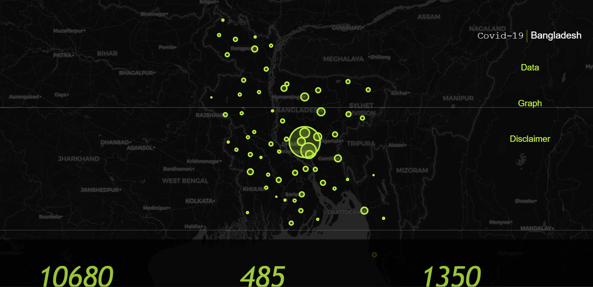
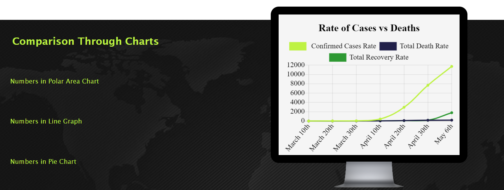
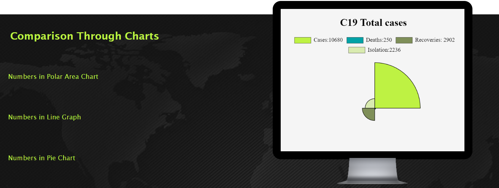
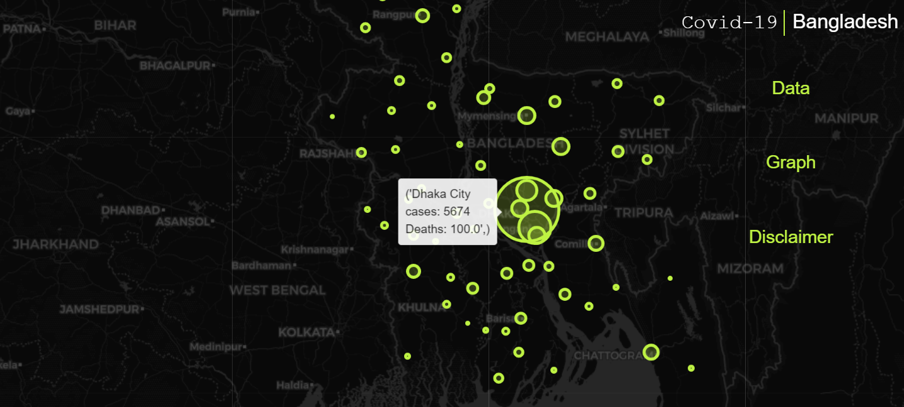

# Covid19-Visualization

<!-- TABLE OF CONTENTS -->
## Table of Contents

* [About The Project](#about-the-project)
* [Project Description](#project-description)
  * [Technical Details](#technology)
  * [Data Collection](#dataset)
  * [Installations](#installations)
  * [Project Link](#project-link)

## About The Project

Covid19 or the novel corona virus has caused a global state of emergency. In this ordeal, we urge everyone, medical professionals, scientists, philanthropists and creatives alike to come together and overcome this crisis. This webpage gives a visual representation of the impact of the virus in Bangladesh as of May 6th, 2020. 
  The webpage shows a map of Bangladesh with green markers depicting the number of cases in every district. The radius of the makers corresponds to the size of cases. It also shows a number of graphs to shed light on the present state of the crisis. 
 
 
  
   

## Project Description
### Technology
The webpage has been done purely in HTML, CSS and JS. We made use of the [Follium](https://pypi.org/project/folium/) library to generate the map using the dataset collected. Furthermore, the graphs were made using [Chart.js](https://www.chartjs.org/)

### Dataset
The data was collected from [IEDCR](https://iedcr.gov.bd/), it was then cleaned, processed and then coordinates of each district was added to plot the data on the map. **Note: The data was collected till May 6th, 2020 only.**

### Installations
The project makes use of no extra packages or such and so to view the webpage, clone the repository, navigate to website directory and run the 'final.html' file.

### Project Link
The project has been deployed on the link https://covid-19-visualisation-b7104.web.app
